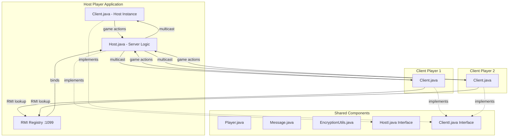
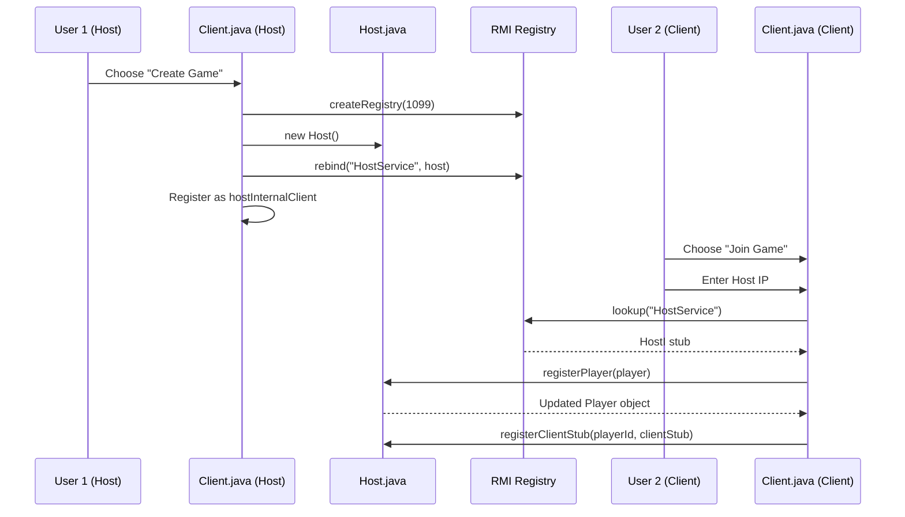
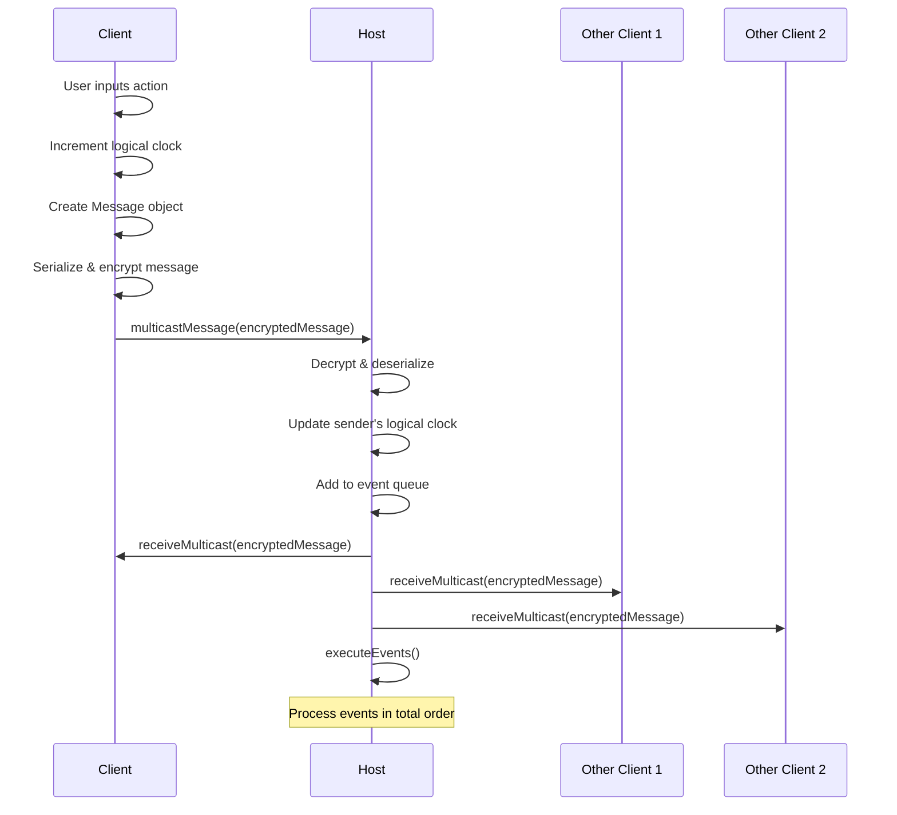
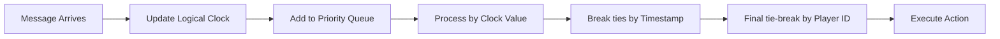
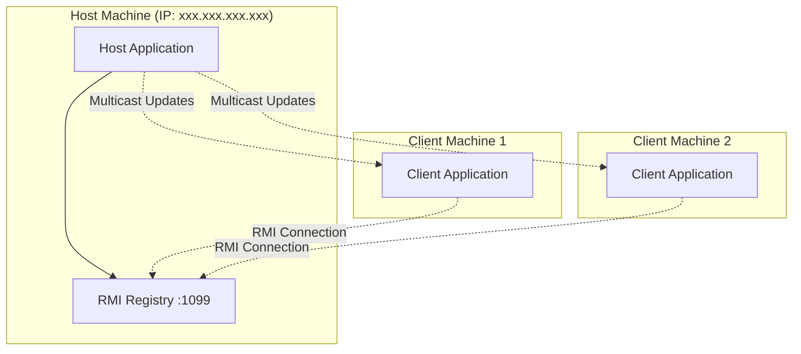

# Design Document
**Course:** Distributed Systems Security  
**Date:** May 2025  
**By:** Ahmed Walid Ibrahim and Ahmed Mohamed Mahmoud

## 1. Introduction

This document outlines the design for a distributed multiplayer shooter game implemented using Java RMI (Remote Method Invocation). The system employs a client-server architecture where the first player acts as both host and client, managing the authoritative game state while other players connect as remote clients. The game features real-time multiplayer interaction on a 10x10 grid with shooting, healing, and movement mechanics, incorporating Lamport's logical clocks for event ordering and XOR encryption for secure message transmission.

## 2. System Architecture Overview

### 2.1 Architectural Pattern
The system implements a **Hybrid Client-Server with Player-as-Host** model:
- **Host Player**: Runs both server logic (`Host.java`) and client logic (`Client.java`)
- **Client Players**: Run only client logic, connecting to the host's RMI registry
- **Communication**: Pure RMI for all interactions (no socket layer)
- **Security**: XOR encryption for message confidentiality

### 2.2 High-Level Architecture Diagram



## 3. Component Design

### 3.1 Core Components

#### 3.1.1 Client.java
**Purpose**: Main client application handling user interface and game interaction
**Key Responsibilities**:
- Menu system for host creation or game joining
- RMI registry management (create/lookup)
- Player registration and authentication
- Game loop with user input processing
- Message serialization/deserialization
- Logical clock management
- Map rendering and game state display

#### 3.1.2 Host.java
**Purpose**: Server-side game logic and state management
**Key Responsibilities**:
- Player registration and symbol assignment
- Game state maintenance
- Event queue management with priority ordering
- Message processing and validation
- Action execution (move, shoot, heal)
- Distance calculations for action range validation
- Multicast message distribution

#### 3.1.3 Player.java
**Purpose**: Data model representing player state
**Attributes**:
- `id`: Unique player identifier
- `x, y`: Grid coordinates (0-9)
- `health`: Player health (0-100)
- `isHost`: Host player flag
- `symbol`: Visual representation character
- `logicalClock`: Lamport clock value

#### 3.1.4 Message.java
**Purpose**: Communication protocol for game events
**Attributes**:
- `playerId`: Source player identifier
- `logicalClock`: Lamport clock timestamp
- `action`: Action type (move/shoot/heal)
- `direction`: Movement direction (for move actions)
- `targetId`: Target player (for shoot/heal actions)
- `timestamp`: System timestamp for tie-breaking

### 3.2 Interface Design

#### 3.2.1 HostI Interface
```java
public interface HostI extends Remote {
    Player registerPlayer(Player p) throws RemoteException;
    List<Player> getPlayers() throws RemoteException;
    void multicastMessage(byte[] encryptedMessage) throws RemoteException;
    void registerClientStub(String playerId, ClientI stub) throws RemoteException;
}
```

#### 3.2.2 ClientI Interface
```java
public interface ClientI extends Remote {
    void receiveMulticast(byte[] encryptedMessage) throws RemoteException;
    void updateGameState(List<Player> players) throws RemoteException;
}
```

## 4. Communication Flow

### 4.1 Game Initialization Sequence



### 4.2 Game Action Processing Flow



## 5. Security Design

### 5.1 Encryption Mechanism
- **Algorithm**: XOR cipher with fixed key (0x5A)
- **Purpose**: Message confidentiality during transmission
- **Implementation**: `EncryptionUtils.xorEncryptDecrypt()`
- **Application**: All game messages encrypted before RMI transmission

### 5.2 Security Considerations
- **Limitations**: XOR with fixed key provides minimal security
- **Improvements**: Could be enhanced with stronger encryption (AES, RSA)
- **Authentication**: Basic player ID validation
- **Authorization**: Host controls all game state modifications

## 6. Concurrency and Synchronization

### 6.1 Logical Clock Implementation
- **Algorithm**: Lamport's Logical Clocks
- **Purpose**: Event ordering in distributed system
- **Update Rule**: `clock = max(local_clock, received_clock) + 1`
- **Application**: Ensures consistent event ordering across all clients

### 6.2 Event Ordering


### 6.3 Synchronization Points
- **Host.java**: All methods synchronized for thread safety
- **Event Queue**: Priority queue ensures total ordering
- **Player List**: Synchronized access for concurrent modifications

## 7. Game Mechanics

### 7.1 Game World
- **Grid Size**: 10x10 coordinate system
- **Player Placement**: Host at (5,5), others random
- **Boundaries**: Movement constrained to grid limits
- **Visualization**: ASCII-based map with player symbols

### 7.2 Player Actions

#### Movement
- **Directions**: up, down, left, right
- **Constraints**: Grid boundaries (0-9 for both x,y)
- **Validation**: Host checks bounds before updating position

#### Combat System
- **Shooting**: Reduces target health by 10 points
- **Healing**: Increases target health by 10 points
- **Range Limit**: Euclidean distance ≤ 3 units
- **Health Range**: 0-100 points
- **Self-targeting**: Prohibited for shooting

### 7.3 Player Identification
- **Symbol Generation**: Sequential assignment (a-z, A-Z)
- **ID Validation**: Case-insensitive matching
- **Reserved IDs**: "hostInternalClient" reserved for host

## 8. Error Handling and Resilience

### 8.1 Network Error Handling
- **Connection Failures**: Graceful degradation with user notification
- **RMI Exceptions**: Specific handling for RemoteException
- **Registry Issues**: Automatic retry for existing registry
- **Host Disconnection**: Client exit when host unreachable

### 8.2 Input Validation
- **Command Parsing**: Robust parsing with error messages
- **Player ID Validation**: Existence checking before action execution
- **Action Validation**: Type and parameter verification
- **Range Checking**: Distance validation for combat actions

## 9. Deployment Architecture

### 9.1 Network Configuration


### 9.2 System Requirements
- **Java Version**: Java 8 or higher
- **Network**: TCP/IP connectivity between all nodes
- **Ports**: 1099 (RMI Registry), dynamic ports for RMI objects
- **Memory**: Minimal requirements for small-scale multiplayer

## 10. Future Enhancements

### 10.1 Scalability Improvements
- **Dynamic Host Migration**: Handle host d
